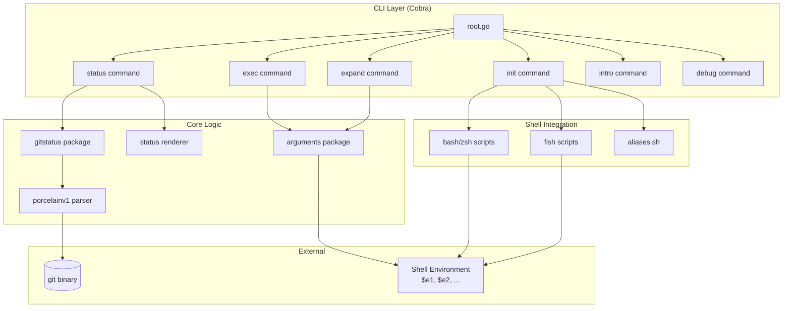
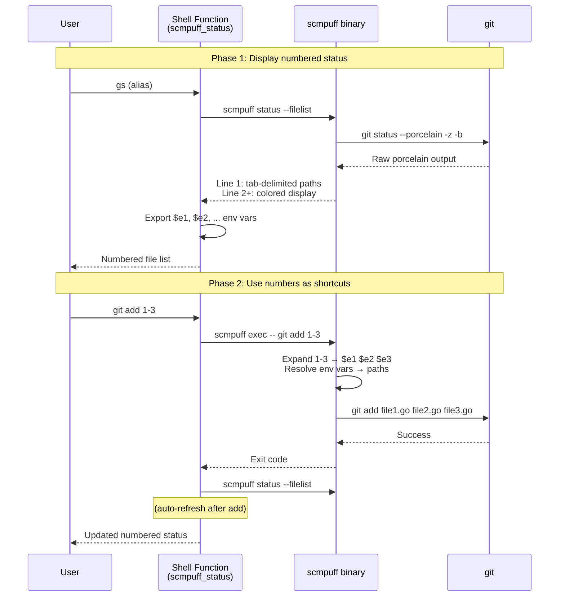

# Codebase Map

> Auto-generated by Cartographer. Last mapped: 2026-02-07

## System Overview



## Data Flow



## Directory Structure

```
scmpuff/
├── main.go                          # Entry point, version injection, banner embed
├── internal/
│   ├── cmd/
│   │   ├── root.go                  # Cobra root command, subcommand wiring
│   │   ├── status/
│   │   │   ├── status.go            # Core: runs git status, invokes parser + renderer
│   │   │   ├── render.go            # Formats numbered status for terminal display
│   │   │   ├── render_test.go       # Golden file tests for rendering
│   │   │   ├── color.go             # ANSI color definitions and semantic mappings
│   │   │   └── testdata/            # Golden files (.ansi.golden, .parsedata.txt.golden)
│   │   ├── exec/
│   │   │   └── exec.go              # Execute commands with numeric args expanded
│   │   ├── expand/
│   │   │   ├── expand.go            # Expand numeric args for shell consumption
│   │   │   └── expand_test.go       # Empty arg handling test
│   │   ├── inits/
│   │   │   ├── init.go              # Shell init command, auto-detects shell type
│   │   │   ├── init_test.go         # Shell detection tests
│   │   │   ├── scripts.go           # //go:embed directives, script assembly
│   │   │   └── data/
│   │   │       ├── status_shortcuts.sh   # bash/zsh: scmpuff_status function
│   │   │       ├── status_shortcuts.fish # fish: scmpuff_status function
│   │   │       ├── git_wrapper.sh        # bash/zsh: git wrapper with expansion
│   │   │       ├── git_wrapper.fish      # fish: git wrapper with expansion
│   │   │       └── aliases.sh            # Shared short aliases (gs, ga, gd, etc.)
│   │   ├── intro/
│   │   │   └── intro.go             # Introductory help text
│   │   └── debug/
│   │       ├── debug.go             # Hidden debug command group
│   │       └── dump.go              # Dump git status for bug reports (ZIP archive)
│   ├── arguments/
│   │   ├── arguments.go             # Core: parse/expand numeric args and ranges
│   │   ├── arguments_test.go        # Table-driven expansion tests
│   │   └── testdata/                # Test fixtures (a.txt, b.txt)
│   └── gitstatus/
│       ├── gitstatus.go             # Data model: StatusInfo, StatusItem, ChangeType
│       ├── gitstatus_test.go        # Path calculation tests
│       └── porcelainv1/
│           ├── process.go           # Parse git status --porcelain=v1 -z -b output
│           ├── process_test.go      # XY code and branch parsing tests
│           ├── golden_test.go       # End-to-end parse tests with go-cmp
│           └── testdata/            # Real porcelain output samples
├── features/                        # Cucumber/Aruba integration tests
│   ├── command.feature              # Basic CLI help
│   ├── command_exec.feature         # exec command scenarios
│   ├── command_expand.feature       # expand command (comprehensive)
│   ├── command_init.feature         # init command + shell detection
│   ├── command_status.feature       # status command (comprehensive)
│   ├── shell_functions.feature      # scmpuff_status shell function (bash/zsh/fish)
│   ├── shell_wrappers.feature       # git wrapper function (bash/zsh/fish)
│   ├── step_definitions/
│   │   └── scmpuff_steps.rb         # Custom steps: git repo setup, shell helpers
│   └── support/
│       ├── env.rb                   # Test environment config, tags, helpers
│       └── aruba.rb                 # Aruba test framework config
├── docs/
│   ├── banner.txt                   # ASCII banner (embedded in binary)
│   ├── CONTRIBUTING.md
│   └── SECURITY.md
├── .github/workflows/
│   ├── lint.yml                     # golangci-lint v2.2
│   ├── release.yml                  # goreleaser on tag push
│   ├── test-integration.yml         # Cucumber tests (ubuntu + macos)
│   └── test-unit.yml                # go test (ubuntu + macos + windows)
├── go.mod                           # Go 1.24, dependencies
├── Makefile                         # Build, test, lint, release targets
├── .goreleaser.yml                  # Multi-platform release config
└── .golangci.yml                    # Linter config (exhaustive on, errcheck off)
```

## Module Guide

### `internal/arguments` — Numeric Argument Expansion

**Purpose**: Core logic for converting numeric shortcuts (e.g., `1`, `1-3`) to environment variable references (`$e1`, `$e2`, `$e3`) and resolving them to file paths.

**Entry point**: `arguments.go`

**Key functions**:
| Function | Purpose |
|----------|---------|
| `Expand(args)` | Expands numeric placeholders and ranges to `$eN` format |
| `EvaluateEnvironment(arg, expandRelative)` | Resolves `$eN` vars to actual file paths |
| `convertToRelativeIfFilePath(arg)` | Converts absolute paths to relative when possible |

**Exports**: `Expand`, `EvaluateEnvironment`
**Dependencies**: stdlib only (`os`, `path/filepath`, `regexp`, `strconv`)
**Dependents**: `cmd/exec`, `cmd/expand`

**Gotchas**:
- Files/directories with numeric names are detected and NOT expanded
- Only scmpuff-managed vars (`$eN`) are converted to relative paths
- `$SCMPUFF_GIT_CMD` is never converted to relative
- Max 4-digit numbers supported

---

### `internal/gitstatus` — Git Status Data Model

**Purpose**: Defines the core data structures for representing git status information.

**Entry point**: `gitstatus.go`

**Key types**:
| Type | Purpose |
|------|---------|
| `StatusInfo` | Top-level container (Branch + Items) |
| `BranchInfo` | Branch name, commits ahead/behind |
| `StatusItem` | Single file change (type, path, original path) |
| `ChangeType` | Enum with 17 variants across 4 groups |
| `ChangeState` | 7 states (new, modified, deleted, renamed, copied, typechanged, untracked) |
| `StatusGroup` | 4 groups (Staged, Unmerged, Unstaged, Untracked) |

**Exports**: All types and their methods
**Dependencies**: stdlib only (`path/filepath`)
**Dependents**: `cmd/status`, `gitstatus/porcelainv1`

**Patterns**: Enum-with-metadata-map pattern for ChangeType. Paths always stored in POSIX style (forward slashes) relative to git root.

---

### `internal/gitstatus/porcelainv1` — Porcelain V1 Parser

**Purpose**: Parses `git status --porcelain=v1 -z -b` output into `StatusInfo`.

**Entry point**: `process.go`

**Key functions**:
| Function | Purpose |
|----------|---------|
| `Process(output)` | Main entry: parses full porcelain output |
| `ExtractBranch(bs)` | Parses branch header line |
| `ConvertEntries(entries)` | Converts parsed entries to StatusItems |
| `extractChangeTypes(x, y)` | Decodes XY status codes into ChangeTypes |

**Exports**: `Process`, `ExtractBranch`, `ConvertEntries`
**Dependencies**: `github.com/mroth/porcelain/statusv1`, `internal/gitstatus`
**Dependents**: `cmd/status`

**Gotchas**:
- Single XY code can produce multiple StatusItems (e.g., `AM` → staged new + unstaged modified)
- Special case: don't show deleted 'Y' during merge conflict
- Branch header format varies: `## Initial commit on master`, `## No commits yet on master`, `## HEAD (no branch)`
- Only porcelain v1 is parsed; v2 is generated for debug dumps but not consumed

---

### `internal/cmd/status` — Status Command

**Purpose**: Main feature — runs `git status`, parses output, renders numbered display with environment variable export.

**Entry point**: `status.go`

**Key files**:
| File | Purpose |
|------|---------|
| `status.go` | Cobra command, git execution, symlink handling |
| `render.go` | Terminal output formatting (Renderer struct) |
| `color.go` | ANSI color definitions and semantic mappings |

**Exports**: `NewStatusCmd()`
**Dependencies**: `internal/gitstatus/porcelainv1`, `internal/gitstatus`
**Dependents**: `cmd/root`

**Flags**: `--filelist, -f` (include machine-parseable file list), `--display` (control display output)

**Gotchas**:
- Exit code 128 when not in git repo
- Uses `git rev-parse --show-cdup` instead of `--show-toplevel` for symlink support
- First output line is tab-delimited file paths (for shell parsing); display starts on line 2
- Display number padding is fixed 2-char width (aligned for 1-99)
- Group ordering is hard-coded: Staged → Unmerged → Unstaged → Untracked

---

### `internal/cmd/exec` — Exec Command

**Purpose**: Executes a command with numeric arguments expanded to file paths inline.

**Entry point**: `exec.go`

**Exports**: `NewExecCmd()`
**Dependencies**: `internal/arguments`
**Dependents**: `cmd/root`, shell wrapper scripts

**Flags**: `--relative, -r`

**Gotchas**: Preserves subprocess exit codes via direct `os.Exit()`, passes through stdin/stdout/stderr.

---

### `internal/cmd/expand` — Expand Command

**Purpose**: Expands numeric arguments to shell-escaped file paths (tab-delimited output for shell consumption).

**Entry point**: `expand.go`

**Exports**: `NewExpandCmd()`
**Dependencies**: `internal/arguments`
**Dependents**: `cmd/root`

**Flags**: `--relative, -r`

**Difference from exec**: Shell-escapes special characters, outputs tab-delimited string instead of executing.

---

### `internal/cmd/inits` — Shell Init Command

**Purpose**: Outputs shell initialization scripts for `eval` in user's shell config.

**Key files**:
| File | Purpose |
|------|---------|
| `init.go` | Cobra command, shell type detection |
| `scripts.go` | `//go:embed` directives, script assembly |
| `data/*.sh` | Bash/zsh shell scripts |
| `data/*.fish` | Fish shell scripts |

**Exports**: `NewInitCmd()`
**Dependencies**: Embedded shell scripts
**Dependents**: `cmd/root`

**Flags**: `--shell, -s` (sh/bash/zsh/fish), `--aliases, -a`, `--wrap, -w`

---

### `internal/cmd/debug` — Debug Tools

**Purpose**: Hidden debug utilities for generating bug report data.

**Key files**:
| File | Purpose |
|------|---------|
| `debug.go` | Parent command (hidden) |
| `dump.go` | Collects environment info, porcelain samples, creates ZIP archive |

**Exports**: `NewDebugCmd()`
**Dependencies**: stdlib (`archive/zip`, `os/exec`)
**Dependents**: `cmd/root`

---

### `internal/cmd/intro` — Intro Command

**Purpose**: Displays introductory help text explaining setup and usage.

**Exports**: `NewIntroCmd()`
**Dependents**: `cmd/root`

---

## Shell Integration Details

### Shell Functions

| Function | Defined In | Purpose |
|----------|-----------|---------|
| `scmpuff_status()` | `status_shortcuts.sh/fish` | Runs `scmpuff status --filelist`, exports `$eN` vars |
| `scmpuff_clear_vars()` | `status_shortcuts.sh/fish` | Unsets `$e1`-`$e999` |
| `git()` | `git_wrapper.sh/fish` | Intercepts git commands, auto-expands numeric args |

### Git Wrapper Command Categories

| Category | Commands | Expansion Mode |
|----------|----------|---------------|
| Absolute paths | commit, blame, log, rebase, merge | `scmpuff exec` |
| Relative paths | checkout, diff, rm, reset, restore | `scmpuff exec -r` |
| Special | add | Expand + auto-run `scmpuff_status` after |
| Passthrough | All others | Direct to git |

### Shell-Specific Quirks

- **Zsh**: Requires `setopt shwordsplit` for proper word splitting
- **Fish**: Array indexing starts at 1; uses `string split \t` for parsing
- **Bash**: Standard behavior, no special handling needed

---

## Conventions

- **Go 1.24** with modules
- **Table-driven tests** used extensively
- **Golden file tests** for rendering output (use `-update` flag to regenerate)
- **POSIX-style paths** internally for cross-platform consistency
- **Exit code 128** when not in a git repository (matches git convention)
- **`errcheck` disabled**, `exhaustive` enabled for switch/map completeness
- **CGO disabled** for cross-platform builds
- **Build flags**: `-mod=readonly`, `-trimpath`

## Gotchas

1. **Numeric filenames**: Files/dirs with numeric names (e.g., `1`) are detected and not expanded as shortcuts
2. **Symlinks**: Uses `git rev-parse --show-cdup` instead of `--show-toplevel` for correct symlink handling
3. **Exit codes**: Subprocess exit codes preserved via direct `os.Exit()`, not returned through Cobra
4. **XY codes**: A single git porcelain XY code can produce multiple StatusItems (e.g., `AM` = staged new + unstaged modified)
5. **Merge conflicts**: Special case suppresses deleted 'Y' status during merge conflict entries
6. **Display padding**: Fixed 2-char width for numbers; behavior with >99 items not explicitly tested
7. **Porcelain v2**: Generated in debug dump but not parsed; only v1 is used
8. **Shell var cleanup**: Old `$eN` vars are cleared before each status call to avoid stale references
9. **`$SCMPUFF_GIT_CMD`**: Set to real git path; never converted to relative path during expansion

## Navigation Guide

**To add a new git subcommand wrapper**: Edit `internal/cmd/inits/data/git_wrapper.sh` and `git_wrapper.fish`, add the command to the appropriate category (absolute/relative paths)

**To add a new CLI subcommand**: Create a new package under `internal/cmd/`, implement `NewXxxCmd() *cobra.Command`, wire it in `internal/cmd/root.go`

**To modify status display formatting**: Edit `internal/cmd/status/render.go`, update golden files with `go test ./internal/cmd/status/ -update`

**To add a new change type**: Add to `ChangeType` enum in `internal/gitstatus/gitstatus.go`, update `changeTypeData` map, update XY code mapping in `internal/gitstatus/porcelainv1/process.go`

**To modify shell integration**: Edit scripts in `internal/cmd/inits/data/`, they're embedded at compile time via `//go:embed`

**To add integration tests**: Add scenarios to `features/*.feature`, use step definitions from `features/step_definitions/scmpuff_steps.rb`

**To run a single unit test**: `go test ./internal/arguments/ -run TestExpandArgs`

**To run a single integration test**: `bundle exec cucumber features/command_status.feature`

**To regenerate golden files**: `go test ./internal/cmd/status/ -update`
