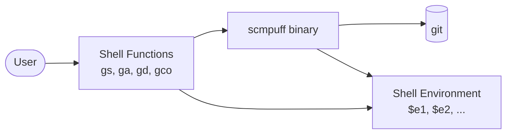
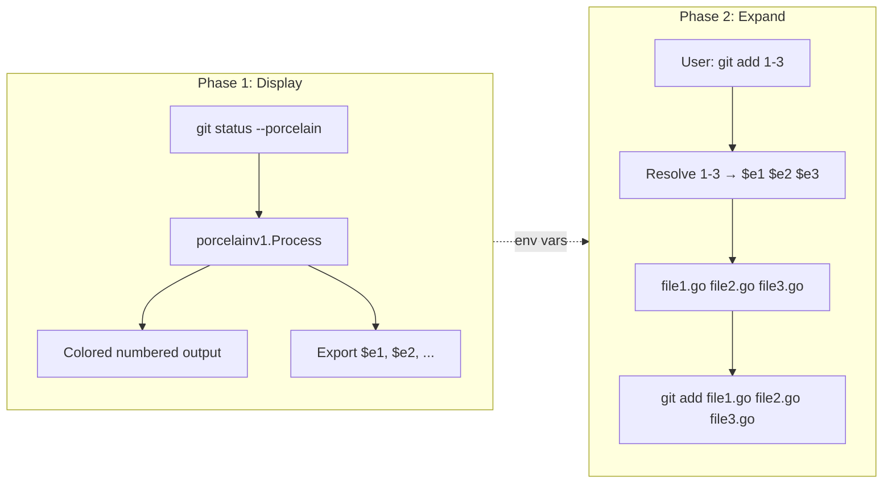

# Architecture Overview

scmpuff is a Go CLI tool that adds numbered shortcuts for file paths in common Git commands. It is a minimalistic reinterpretation of [SCM Breeze](https://github.com/ndbroadbent/scm_breeze), focused on simplicity, speed, robustness, and cross-platform support.

## Design Principles

- **Compiled core, thin shell layer**: The majority of logic lives in a compiled Go binary. Shell integration is under 100 lines of script per shell, minimizing shell-specific complexity.
- **Environment variable bridge**: The binary and shell communicate through numbered environment variables (`$e1`, `$e2`, ...). This avoids temp files and works across all supported shells.
- **Porcelain parsing**: Uses `git status --porcelain` for machine-stable output parsing rather than scraping human-readable git output.
- **Cross-platform**: CGO is disabled; builds target Linux, macOS, and Windows across amd64/arm/arm64.

## System Context

scmpuff sits between the user's shell and git. Shell functions intercept common git commands, delegate to the scmpuff binary for numeric expansion, and manage environment variables that map numbers to file paths.

## Two-Phase Workflow

The core interaction has two phases:

1. **Display phase** (`scmpuff status`): Runs `git status --porcelain -z -b`, parses output, renders a numbered file list, and exports file paths as `$e1`, `$e2`, etc.
2. **Expansion phase** (`scmpuff exec` / `scmpuff expand`): Resolves numeric arguments (e.g., `1-3`) back to file paths via the environment variables set in phase 1.

## Technology Choices

| Choice | Rationale |
|--------|-----------|
| Go | Single binary distribution, fast startup, cross-platform without CGO |
| Cobra | Standard Go CLI framework, handles subcommands and flags |
| `//go:embed` | Shell scripts compiled into binary — no external files to manage |
| Porcelain v1 | Machine-stable git output format; v2 exists but v1 is sufficient |
| Cucumber/Aruba | End-to-end integration tests that exercise the actual binary in real shells |

## Component Overview

The binary is organized into three layers:

| Layer | Packages | Responsibility |
|-------|----------|---------------|
| CLI | `cmd/root`, `cmd/status`, `cmd/exec`, `cmd/expand`, `cmd/inits` | Command definitions, flag parsing, I/O |
| Core Logic | `arguments`, `gitstatus`, `gitstatus/porcelainv1` | Numeric expansion, git status parsing |
| Shell Integration | Embedded scripts in `cmd/inits/data/` | Shell functions, git wrappers, aliases |

For detailed module-by-module documentation, see [CODEBASE_MAP.md](../CODEBASE_MAP.md).

## Key Design Decisions

### Why environment variables instead of temp files?

Environment variables are shell-native, require no cleanup, and naturally scope to the current shell session. Multiple terminal windows each maintain independent numbered file lists without conflicts.

### Why embed shell scripts?

Embedding via `//go:embed` means `scmpuff init` outputs scripts directly — no need to locate installed script files at runtime. Users `eval` the output in their shell config, keeping setup to a single line.

### Why separate `exec` and `expand` commands?

- `exec` runs a command directly with expanded arguments (used by shell wrappers)
- `expand` outputs expanded paths for shell consumption (used for programmatic access)

The separation allows the shell wrapper to use `exec` for transparent command execution while `expand` provides a composable building block.
